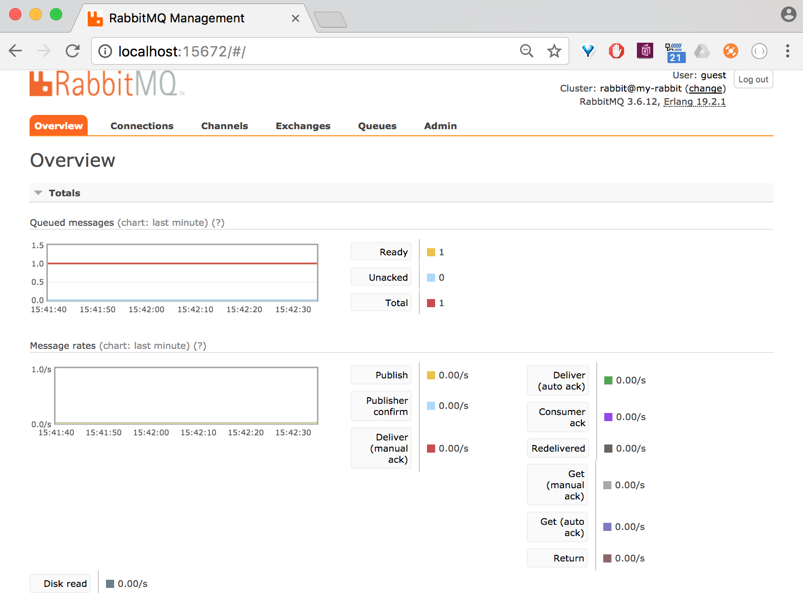

## Using the Docker rabbitmq:3-management image

### Getting the image

1. Issue: docker run -d --hostname my-rabbit --name some-rabbit -p 5672:5672 -p 15672:15672 rabbitmq:3-management
1. The ports must be called explicitly, otherwise a connection refused message is the result of connecting

This will create:
1. An image with the name: rabbitmq:3-management
1. A container with the name: some-rabbit
1. -p 5672:5672 -> this is the port where rabbitmq listens for messages
1. -p 15672:15672 -> this is the port where the mngmt functionality listens for commands
1. --hostname my-rabbit -> don't know the usage for this

### Helpful commands:
1. docker ps -> to show if the image is still running
1. docker rm some-rabbit -> to remove the container to create a new one
1. docker logs some-rabbit -> show output from rabbit
1. docker help command -> docker help rm -> help on how to remove a container

### Using the web mngmt console

The weconsole overview 1.

The weconsole overview 2.

Information about the exchanges.

Information about queues.

Information of interest to the admin.

